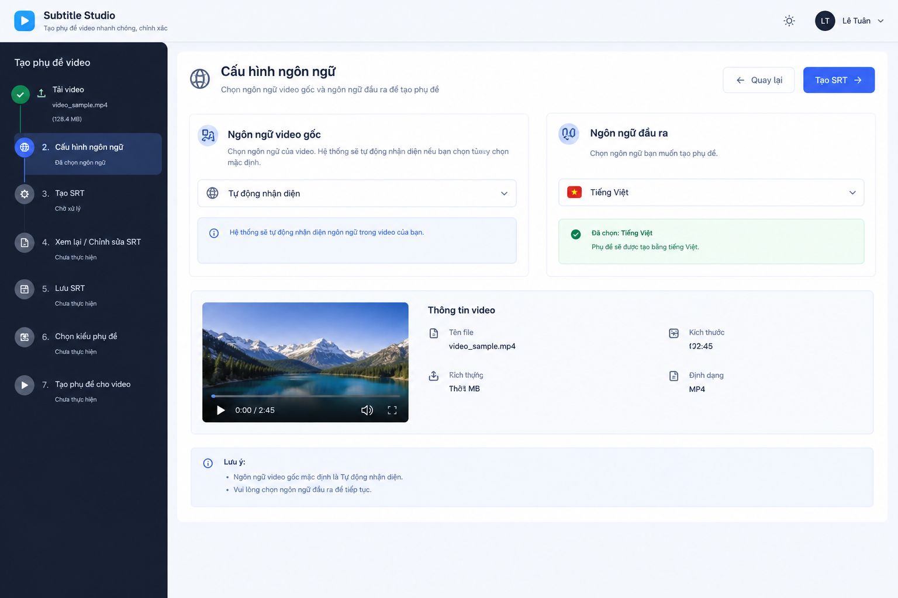

# Subtitle Studio (sub-tool)

Công cụ tạo phụ đề video chạy hoàn toàn trên máy local — không gửi video đi đâu:

**Upload video → nhận diện ngôn ngữ → Transcribe 2 pass (PhoASR viết đúng chính tả + BuzzASR lấy timing từng từ) → hiệu chỉnh phụ đề → dịch máy (tùy chọn) → lưu `.srt` → chỉnh style → render burn-in word-by-word bằng Remotion.**



---

## A. Clone & cài 1 lệnh

> Chạy được trên **Windows 10/11** và **Ubuntu 22.04+** (đã test trên Ubuntu 24.04).
> Chỉ cần sẵn **Node.js ≥ 20** và **Python 3.10–3.12** — phần còn lại script tự cài.

```bash
git clone https://github.com/tuanlee-tech/subtitle-studio.git
cd subtitle-studio
./setup.sh            # Windows: setup.cmd  ·  hoặc: npm run setup
```

`setup` tự làm hết: `npm install` → tạo `.venv` → `pip install` → **tải sẵn model AI ~3GB**
→ in checklist. Lần đầu mất ~15–20 phút (tùy mạng), chạy lại sau chỉ vài giây.

**Ghi chú:**

| Việc | Chi tiết |
|---|---|
| Chưa cài Node/Python | `setup.sh`/`setup.cmd` tự báo đúng lệnh cài (xem mục B bên dưới) |
| Mạng yếu, không muốn tải model ngay | `npm run setup -- --skip-model` — model tự tải lần đầu bấm **Transcribe** |
| Chưa cài Chrome/Edge | Remotion tự tải headless shell lúc render lần đầu (cần mạng) |
| Chưa cài ffprobe/ffmpeg | **Không cần** — metadata video đọc bằng `@remotion/media-parser`, ffprobe chỉ là fallback |
| Muốn dừng app | Đóng cửa sổ console / terminal đang chạy |
| Dữ liệu của bạn | Nằm trong `storage/` ngay trong thư mục project |

---

## B. Phát triển (dev)

> Clone sang máy mới? Làm theo **[CLONE.md](CLONE.md)** (có bước push/clone + checklist lần đầu).

### Yêu cầu hệ thống

| Thành phần | Windows | Ubuntu |
|---|---|---|
| **Node.js ≥ 20** (bắt buộc) | https://nodejs.org | `sudo apt install nodejs` (hoặc nvm) |
| **Python 3.10 – 3.12** (bắt buộc) | https://www.python.org (tick *Add to PATH*) | `sudo apt install python3.12 python3.12-venv` |
| ffprobe/ffmpeg — **tùy chọn** | `winget install Gyan.FFmpeg` | `sudo apt install ffmpeg` |
| Chrome/Edge/Chromium — cho render | có sẵn Edge | `sudo apt install chromium-browser` *(không cài thì Remotion tự tải)* |

> Ubuntu thiếu gói `python3.x-venv` vẫn chạy được: `npm run setup` sẽ tự tạo `.venv` không kèm pip
> rồi nạp pip từ `bootstrap.pypa.io` (cần mạng).

### Cài đặt & chạy

```bash
npm run setup        # = ./setup.sh / setup.cmd: mọi thứ ở mục A
npm run dev          # → http://localhost:5173  (UI, mở URL này)
```

Kiểm tra môi trường bất cứ lúc nào (không cài gì):

```bash
npm run doctor
```

### Chế độ production (1 port duy nhất)

```bash
npm run build        # build web → web/dist
npm start            # → http://localhost:4174  (server tự serve web/dist)
```

### Phục hồi & hiệu năng

| Tính năng | Chi tiết |
| --- | --- |
| Terminal theo từng bước | Mỗi màn hình có mục `Terminal` (mở/đóng) xem log thật của bước đó — tối đa 2000 dòng, tự mở khi có lỗi, nút Sao chép/Xóa. Log đầy đủ giữ trên ổ: `storage/<id>/logs/<bước>.log`. |
| Khôi phục phiên | Sau F5 / mất kết nối, app nhớ video đang làm (`localStorage` + `GET /api/videos/:id/state`) và mở lại đúng bước, ngôn ngữ, kiểu phụ đề. |
| Dùng lại SRT cũ | Bước 3 nhận file `.srt` có sẵn → bỏ qua bước nhận diện, làm tiếp từ bước xem lại. |
| Transcribe chia đoạn · song song · resume | Âm thanh tách thành đoạn 60s (đè nhau 1s), chạy song song ≤4 worker, checkpoint trong `storage/<id>/chunks/` — chạy dở dừng thì chạy lại chỉ làm tiếp đoạn thiếu (kể cả bước text). |
| Tải lên resumable | Video gửi theo lát 5MB; mất kết nối chỉ gửi lại lát vừa rớt thay vì cả tệp. |
| Cache bundle Remotion | Lần render đầu đóng gói vài chục giây, các lần sau dùng `node_modules/.cache/subtitle-studio-bundle` (tự đóng gói lại khi mã nguồn/font thay đổi). |

Biến môi trường tùy chọn:

| Biến | Mặc định | Ý nghĩa |
| --- | --- | --- |
| `SUBTOOL_WORKERS` | `min(4, CPU−1, RAM/4GB)` | số worker song song của bước tạo SRT |
| `SUBTOOL_CHUNK_SEC` | `60` | độ dài mỗi đoạn tính bằng giây (tối thiểu 10) |

### CLI (không qua giao diện)

```bash
npm run sub -- video.mp4                  # detect ngôn ngữ → transcribe → render
npm run sub -- video.mp4 --lang vi --yes  # bỏ qua bước hỏi
```

### Kiểm thử

```bash
npm run typecheck    # TypeScript
npm run build        # vite build
npm run doctor       # checklist môi trường
./setup.sh           # hoặc npm run setup — cài lại từ đầu (idempotent)
node scripts/qa-ui.mjs      # test UI qua Chrome headless (cần Chrome + server đang chạy)
node scripts/qa-guide.mjs   # test tour hướng dẫn
```

### Cấu trúc thư mục

| Đường dẫn | Nội dung |
|---|---|
| `server/` | API Express (4174): upload, transcribe, translate, render, fonts |
| `web/` | React UI (7 bước) — build ra `web/dist` |
| `src/` + `lib/` | Dựng hình Remotion (composition burn-in, layout, style) |
| `scripts/` | pipeline Python (transcribe/translate/detect), setup, prefetch model, QA |
| `public/` | Font Baloo2 + font người dùng tải lên |
| `models/` | CT2 model đã convert (tự tạo khi chạy lần đầu) |
| `storage/` | Job của bạn: video, transcript, srt, output |
| `.venv/` | Môi trường Python (tự tạo bởi `npm run setup`) |

### Lỗi thường gặp

| Triệu chứng | Cách xử lý |
|---|---|
| Health `ok:false`, lỗi Python ở bước Transcribe | `.venv` thiếu/gãy → `npm run setup` |
| Health báo `thiếu transformers, sentencepiece` | `.venv` chưa đủ gói → `npm run setup` |
| `npm run setup` báo thiếu ensurepip / `python3-venv` | Ubuntu: `sudo apt install python3.12-venv`, hoặc bỏ qua — setup tự nạp pip qua mạng |
| Setup báo "Tải model thất bại" | Mạng lúc đó — app vẫn dùng được, model tự tải lần đầu bấm Transcribe; hoặc chạy lại `npm run setup` |
| Upload báo "Không đọc được metadata video" | File hỏc hoặc định dạng lạ — thử cài ffmpeg (`sudo apt install ffmpeg` / `winget install Gyan.FFmpeg`) để mở đường fallback |
| Transcribe lần đầu rất chậm | Đang tải model ~3GB vào `models/` + cache HuggingFace |
| Render báo thiếu browser | Để trống — Remotion tự tải, hoặc cài Chrome/Edge |
| `pip` fail khi cài `torch==...+cpu` | Đừng xóa dòng `--extra-index-url .../whl/cpu` trong `requirements.txt` |
| Transcribe crash `open() got an unexpected keyword argument 'metadata_errors'` | `av` 19 quá mới so với faster-whisper → `npm run setup` (requirements đã ghim `av<19`) |
| Port 4174/5173 đã được dùng | Đóng instance `npm run dev` đang chạy trước đó — Ubuntu: `lsof -ti:5173 -ti:4174 \| xargs -r kill` · Windows: `netstat -ano \| findstr :5173` rồi `taskkill /PID <pid> /F` |
